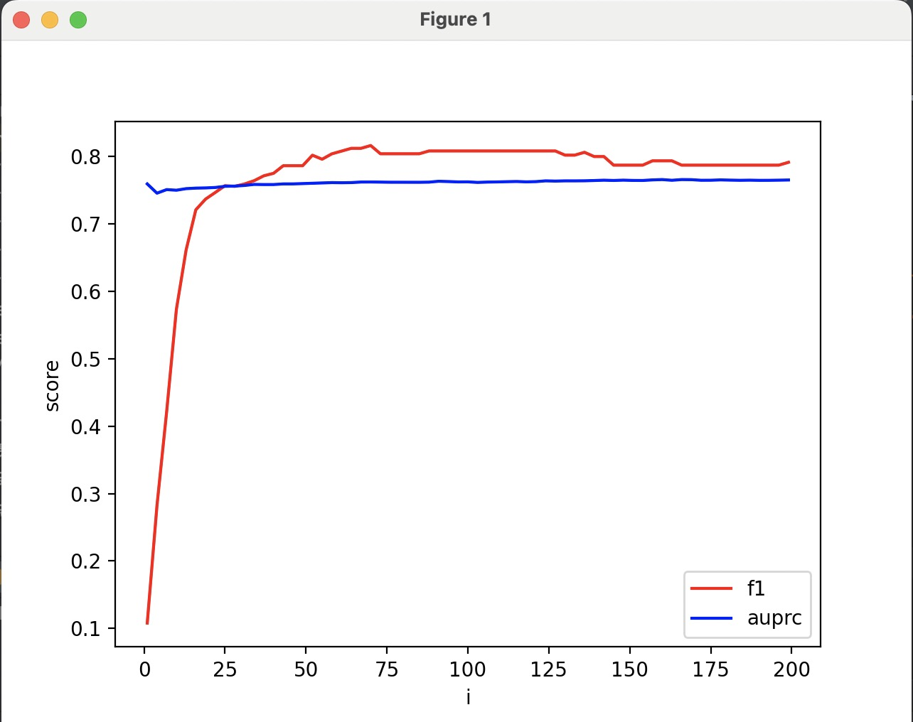

# 分析报告

本次作业为组队：

郑英齐21302010024

孟展21302010039

## 数据预处理

我们认为时间属性是没用的，直接把它去除。

金额属性不作为训练的参照，用作每个样本的权重，即进行成本敏感分析。

所以训练参数为V1~V28。

为了解决欺诈样本过少的问题，使用了过采样，将正例样本进行复制，复制的程度作为一个超参数，在我们的分析中进行了调整。

## 训练

我们对比了4种分析模型，逻辑回归、决策树、随机森林、adaboost

## 不同算法比较

下面的数据是过采样使得正反例数量相等情况下得到的

### 逻辑回归模型

F1分数:  0.108
auprc分数：0.759
代码运行时间：1.62 秒

### 决策树模型

F1分数：0.770
auprc分数：0.772
代码运行时间：15.41 秒

### 随机森林模型

F1分数:  0.859
auprc分数:  0.884
代码运行时间：20.58 秒

### AdaBoost模型

F1分数:  0.076
auprc分数：0.571
代码运行时间：20.09 秒

## 超参数调节

我们发现逻辑回归运行时间最短，所以使用这个进行超参数调节。我们这里假定，所有的模型超参数相近（因为其他模型运行时间太久了）

下图横坐标为正例数量和反例数量的比值，纵坐标为F1和AUPRC。最终决定比值为75。

## 第二次算法比较

下面的数据是过采样使得正反例比值为75情况下得到的

### 逻辑回归模型

F1分数:  0.804
auprc分数：0.762
代码运行时间：1.37 秒

### 决策树模型

F1分数:  0.763
auprc分数:  0.766
代码运行时间：16.18 秒

### 随机森林模型

F1分数:  0.847
auprc分数:  0.874
代码运行时间：11.95 秒

### AdaBoost模型

F1分数:  0.719
auprc分数:  0.727
代码运行时间：11.89 秒

最终决定使用随机森林。

## 最终训练

10改成50

`model = RandomForestClassifier(n_estimators=50, random_state=42)`

F1分数:  0.876
auprc分数:  0.877
代码运行时间：98.05 秒

### Intel加速比（随机森林模型）

- 使用Intel：

  F1分数:  0.819
  auprc分数:  0.800
  代码运行时间：4.97 秒

- 使用普通库：

  F1分数:  0.876
  auprc分数:  0.877
  代码运行时间：98.05 秒

加速比为19.72